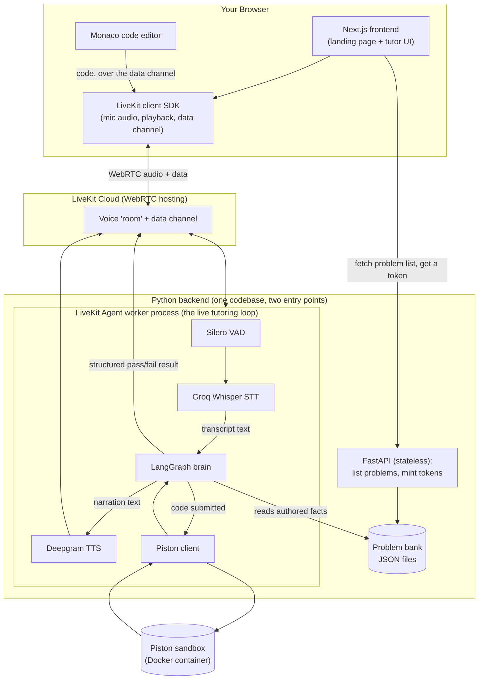
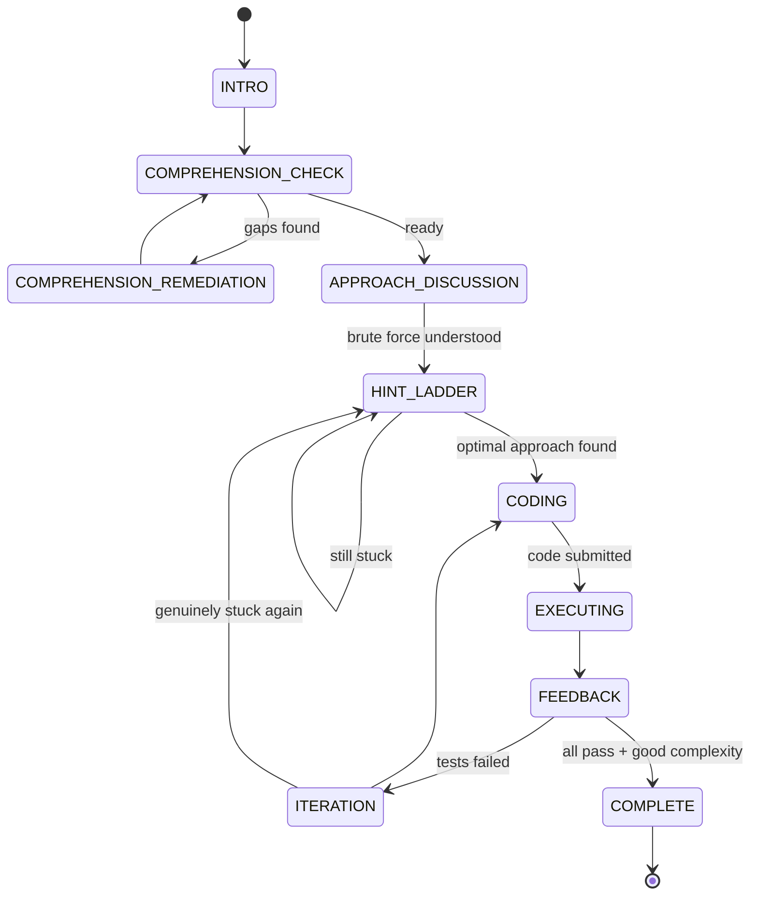

# Volna, Explained From Zero

This document exists so you can walk into an interview and explain **everything** about this project, even if you've never touched agentic AI or voice AI before today. Every piece of jargon is explained the first time it shows up. Nothing is assumed.

Read it top to bottom once, then use the headers to jump back to whatever you get asked about.

---

## 1. What is Volna, in one paragraph?

Volna is a voice-controlled AI tutor that teaches you how to solve coding interview problems (the kind called "DSA" problems — **D**ata **S**tructures and **A**lgorithms, like "Two Sum" or "reverse a linked list"). You talk to it out loud, like a phone call. It asks you to explain the problem back in your own words, makes you describe a brute-force (slow, naive) solution before letting you jump to the clever one, gives you hints only when you're actually stuck, lets you type real code in an editor, and then actually **runs your code** against real test cases and tells you — out loud — whether it passed. The whole point is that it refuses to just hand you the answer, the way a good human tutor would.

The one sentence to remember: **it's a real-time voice conversation, backed by a rule-based "brain" that uses an LLM only to judge and narrate, never to invent facts, wired up to a real code execution sandbox.**

---

## 2. Glossary — every unfamiliar word, explained before you need it

Read this section fully. Everything below gets used constantly in the rest of this doc and in an interview.

- **LLM (Large Language Model)** — a program like GPT-4, Claude, or Llama that has been trained on huge amounts of text and can generate human-like text in response to a prompt. It doesn't "know" facts the way a database does — it predicts the most statistically likely next words. This is why LLMs can **hallucinate** (see below).
- **Hallucination** — when an LLM confidently states something false, because it's just predicting plausible-sounding text, not looking anything up. This is the single biggest risk in any LLM-based product, and a huge chunk of this project's design exists specifically to prevent it (see Section 6).
- **Prompt** — the text instructions you give an LLM. A "system prompt" sets the LLM's role/rules; a "user prompt" is the specific input/question for that call.
- **Agentic AI / AI agent** — instead of just answering one question, an "agent" is an AI system that takes actions, uses tools, and moves through multiple steps toward a goal, often with some autonomy over what it does next. Volna's tutor is "agentic" in that it holds a multi-step conversation, decides what phase of tutoring to move to next, calls a code-execution tool, and adapts based on what you say — not just one prompt-in, text-out call.
- **Voice AI** — any system where you interact by speaking instead of typing. It needs three things working together: hearing you (speech-to-text), understanding/responding (the "brain," often an LLM), and speaking back (text-to-speech). Volna does all three.
- **STT (Speech-to-Text)** — converts your spoken audio into written text. Volna uses **Groq's hosted Whisper large-v3** model for this (Whisper is OpenAI's open speech-recognition model; Groq just hosts it and makes it very fast).
- **TTS (Text-to-Speech)** — converts written text into spoken audio. Volna uses **Deepgram's TTS**.
- **VAD (Voice Activity Detection)** — a lightweight model that listens to raw audio and decides "is someone talking right now, or is this silence/background noise?" It's what lets the system know when you've started and stopped speaking, so it knows when to start listening and when to reply. Volna uses **Silero VAD** (a small, fast, open-source VAD model), bundled directly into the voice framework.
- **Turn-taking / turn detection** — the logic that decides "the user has finished their sentence, it's the AI's turn to respond now" vs. "they're just pausing to think, don't interrupt." This is genuinely one of the hardest parts of voice AI — humans pause mid-thought constantly, and naive systems either interrupt you or wait forever.
- **Barge-in / interruption** — when the user starts talking while the AI is still talking, and the AI should stop and listen instead of talking over them, like a real conversation. This project had to specifically tune how sensitive this is (see Section 9).
- **WebRTC** — the underlying internet protocol standard for real-time audio/video streaming in a browser (the same tech video calls use). It's what makes "talk to the AI live, low-latency, no page reloads" possible.
- **LiveKit** — a company/platform that provides WebRTC infrastructure as a service (audio "rooms" you can join) plus a Python framework (**LiveKit Agents**) specifically for building voice AI bots that join those rooms. Volna's entire voice layer runs on LiveKit — see Section 5.
- **LangGraph** — a Python library (by the same people who make LangChain) for building "graphs" of connected steps ("nodes") with explicit rules ("edges") about which step runs next. Think of it like a flowchart you can actually execute in code, where each box might call an LLM, and the arrows between boxes are decided by real code logic, not by the LLM deciding for itself. This is the core of Volna's "brain" — see Section 4.
- **State machine** — a general computer-science concept: a system that is always in exactly one "state" (here called a "phase," like `COMPREHENSION_CHECK` or `HINT_LADDER`), and moves between states based on defined rules. LangGraph is used here to implement a state machine.
- **Node** (in LangGraph) — one step/box in the graph. Each node here is a Python function that reads the current state, maybe calls the LLM, and returns what changed.
- **Structured output / JSON mode** — instead of letting an LLM reply with free-form text ("I think the student understands the problem pretty well..."), you force it to reply with a strict JSON object matching an exact schema (e.g. `{"ready_to_advance": true, "score": 85, "gaps": [...]}`). This makes the LLM's output something your code can reliably check with an `if` statement, instead of trying to parse meaning out of prose. Volna uses this for every single LLM call in the brain.
- **Pydantic** — a Python library for defining the "shape" of data (a schema/class) and automatically validating that data actually matches that shape, raising an error if it doesn't. Used here to define exactly what fields each LLM response must contain, and to validate the LLM's JSON output against that shape before trusting it.
- **Grounding** — making an LLM's answer based only on specific facts you hand it in the prompt, instead of whatever it "remembers" from training. This is the main technique Volna uses to fight hallucination (Section 6).
- **RAG (Retrieval-Augmented Generation)** — a common technique where you search a database/documents for relevant facts and stuff them into the prompt before asking the LLM to answer, so it's grounded in real retrieved data. Volna does NOT use RAG — it doesn't need to "search" anything, because the small set of facts each node needs (a specific hint, a specific test case explanation) is already known ahead of time and can be looked up directly in Python and inserted into the prompt. That's a simpler, more reliable version of the same underlying idea.
- **Sandbox (code execution sandbox)** — an isolated environment for running untrusted code safely, so that if the code does something malicious or broken (infinite loop, deletes files, etc.) it can't harm the real server. Volna uses **Piston**, a free, self-hostable code-execution API, run here as a local Docker container.
- **Docker / container** — a way to package and run software (like Piston) in an isolated, reproducible environment, separate from your main operating system.
- **Data channel** — in WebRTC/LiveKit, besides the audio stream, there's a separate channel for sending arbitrary structured data (like JSON messages) between the browser and the server in real time. Volna uses this to send your typed code to the backend and get execution results back, entirely separately from the voice audio.
- **Text stream** — LiveKit's mechanism for sending a growing piece of text (like a live transcript) incrementally, chunk by chunk, over the data channel, instead of one big message at the end.
- **Endpointing** — part of turn-detection: deciding, based on a pause length, that the user has "ended" their turn and it's safe to start generating a reply.
- **Complexity (Big-O)** — in computer science, a way of describing how the runtime or memory use of an algorithm grows as the input gets bigger (e.g. O(n) = linear, O(n²) = quadratic/roughly "grows as the square of input size"). Volna doesn't just check if your code gives the right *answer* — it actually measures, empirically, whether your code's speed matches the complexity the problem expects (Section 8).
- **tracemalloc** — a built-in Python tool for measuring how much memory a piece of code actually used while running. Used here for the complexity-measurement feature.
- **Monaco Editor** — the actual code editor component that powers VS Code, available as a reusable web component. Volna embeds it as the in-browser code editor.
- **Next.js / App Router** — the React framework used for Volna's frontend website. "App Router" is Next.js's current file-based routing system (folders under `app/` become URL routes).
- **FastAPI** — a Python web framework used here for the small, stateless backend API (listing problems, minting connection tokens).
- **Groq** — an AI infrastructure company known for extremely fast LLM inference (running models). Volna uses Groq for both the LLM (Llama 3.3 70B) and the speech-to-text (hosted Whisper), because Groq's free tier made both essentially free for a solo/demo project.
- **Llama 3.3 70B** — the specific open-weight LLM (made by Meta, 70 billion parameters) that Volna uses as its "judge and narrator." All the grading/narration calls in the brain use this exact model via Groq.
- **Token (LLM sense, not crypto)** — the unit LLMs process text in (roughly ~¾ of a word). API usage/pricing/rate-limits are usually measured in tokens. This is unrelated to the "LiveKit connection token" mentioned elsewhere (an access credential) — same word, two different meanings, worth being careful about in an interview.
- **Rate limit / quota** — a cap a provider puts on how much you can call their API (e.g. Groq's free tier: 100,000 tokens per day for this model). Hitting it makes calls fail until it resets.

---

## 3. The big picture: what talks to what



Two services, one Git repository:

1. **`web/`** — the Next.js frontend. This is a "dumb" UI shell: it shows the landing page, lists problems, renders the code editor and chat transcript, and connects to LiveKit. It contains **zero tutoring intelligence** — it doesn't grade you, doesn't know what a good hint looks like, nothing. It just displays whatever the backend tells it to.
2. **`server/`** — the Python backend, which is actually two different running programs sharing the same code:
   - `server/api/main.py` — a small **FastAPI** app with exactly two real jobs: `GET /problems` (list problems) and `POST /livekit/token` (mint a LiveKit connection credential so the browser can join a voice room). It's stateless — it doesn't remember anything about a session.
   - `server/agent/worker.py` — the **LiveKit Agent worker**. This is the actual live tutoring loop: it joins the voice room, listens, thinks, speaks, and runs code. All the actual intelligence lives here (well — it lives in `server/graph/`, and the worker just wires that brain up to real audio).

There's deliberately **no database**. Session state (what phase of the conversation you're in, what hints you've seen, etc.) lives only in memory, inside the Python worker process, for as long as that one conversation lasts. If you want to understand why, see Section 12 ("resumable sessions").

---

## 4. The Brain: LangGraph state machine

This is the most important part of the project to be able to explain clearly, because it's the actual "engineering idea" of Volna, not just "we called an LLM."

### 4.1 The core insight

**The LLM is never the source of truth about anything.** It's only ever asked to do two things:
1. **Judge** — "does the student's explanation match this specific, human-written list of key points?"
2. **Narrate** — "phrase this feedback warmly, out loud, in a tutor's voice."

Every actual fact the tutor states — every hint, every edge case, every "why brute force isn't good enough," every pass/fail verdict — comes from either (a) content a human wrote ahead of time and stored in a JSON file, or (b) the real, measured output of running your code. The LLM is a judge and a mouthpiece, never an author of facts. This matters enormously because classic interview problems like "Two Sum" are exactly the kind of thing an LLM has memorized (sometimes wrong, or a slightly different variant) from its training data — so it can never be trusted to just "know" the problem.

### 4.2 The conversation as a flowchart (the actual state machine)



Each of those boxes ("phases") is one Python function (called a "node"). Here's what each one actually does, and — importantly — where its facts come from:

| Phase / Node | What it does | Where the facts come from |
|---|---|---|
| **INTRO** | Reads the problem statement out loud. **No LLM call at all** — it's just printing text a human wrote. Nothing to hallucinate. | The problem's authored `statement` text |
| **COMPREHENSION_CHECK** | You explain the problem back in your own words. An LLM call grades your explanation against a list of "key points" the problem should cover, and returns which points you covered and which you missed. | The problem's authored `comprehension_rubric.key_points` |
| **COMPREHENSION_REMEDIATION** (via `loophole_node`) | If you missed something, delivers one specific "edge case to think about" (e.g. "what about duplicate values in the array?"), then sends you back to explain again. | The problem's authored `common_loopholes` list, delivered **verbatim** — the LLM only rephrases the delivery warmly, it cannot invent a new edge case |
| **APPROACH_DISCUSSION** (`brute_force_node`) | Makes you describe the slow, brute-force solution and explain why it's not good enough, before you're allowed to jump to the clever solution — this stops people from skipping straight to "just use a hashmap" without understanding why. | The problem's authored `brute_force.description` / `why_insufficient` |
| **HINT_LADDER** (`hints.py` + `optimal_approach_node`) | Gives you increasingly specific hints, one level at a time, only advancing once you've seemed stuck for **two consecutive turns** (not just one confused sentence) — this stops the tutor from being trigger-happy with hints. | An authored, ordered list `hint_ladder[]`, delivered word-for-word |
| **CODING** | You type code in the editor; a small LLM "probe" may ask you a clarifying question about a specific decision in your actual code (not a generic question). | Your real code, read directly |
| **EXECUTING** | Your code is actually run against real test cases in a sandbox (see Section 8). | Real execution results from Piston, not invented |
| **FEEDBACK / ITERATION** | Explains, out loud, why specific tests failed, and decides whether to send you back to fix code or back to hints if you're stuck on the same failure repeatedly. | The real pass/fail results, plus authored `explanation_if_failed` text per test case |
| **COMPLETE** | Congratulates you — but only once your code both passes every test **and** its measured speed/memory growth actually matches the expected complexity class (Section 8). | Real measured timing/memory data |

### 4.3 Why the LLM never picks its own next step

This is a subtle but important design decision: **the LLM's structured output only ever produces data (like `ready_to_advance: true/false`) — it never directly says "go to phase X."** All of the arrows in the flowchart above are decided by plain Python `if` statements reading that data (LangGraph calls these "conditional edges"). This means the LLM can be wrong about *how* to phrase something, but it can never accidentally skip a step, loop forever, or jump ahead, because the actual routing logic is deterministic code, not a suggestion the LLM makes.

### 4.4 "Turn-based" graph, not a live loop

A subtlety worth knowing: the LangGraph graph is **not** a continuously-running process. Each time you say something (one "turn"), the backend runs the graph exactly once from wherever it left off, gets back "here's what changed and here's what to say," speaks that, and then just... stops and waits for your next turn. This is much simpler and more predictable than trying to keep a long-running loop synchronized with live audio.

### 4.5 Anti-hallucination techniques, concretely

Since fighting hallucination is the headline engineering theme of this whole brain, here's the actual checklist Volna implements — good to have ready verbatim in an interview:

1. Every grading prompt explicitly tells the LLM: *"grade solely using the context given below, ignore anything you remember about this problem from training."*
2. All hint text, edge-case descriptions, and "why brute force fails" explanations are **authored by a human in advance** and delivered close to word-for-word — the LLM only adds warm transitional phrasing, never new facts.
3. Every LLM call uses **structured JSON output** validated against a **Pydantic schema**, so malformed or nonsensical output gets caught by code, not silently trusted.
4. If the JSON is invalid, there's **one automatic repair retry** (re-asking with the error shown), then a safe hardcoded fallback (e.g. "assume not ready, ask them to explain again") — the system is designed to **never crash and never silently pretend success** it didn't actually verify.
5. Low "temperature" (a setting controlling how random/creative an LLM's output is — near 0 is very deterministic) is used for all grading calls, since creativity is exactly what you don't want from a judge.
6. Test-passing and complexity results shown to the user are **real measured numbers from actually running the code**, never guessed or estimated by the LLM.

---

## 5. The Voice Layer: how "talking to it" actually works

### 5.1 The pieces, and why each one exists

Voice AI is really a pipeline of separate specialized tools duct-taped together, not one magic model:

```
Your voice  →  VAD (is someone talking?)  →  STT (what did they say?)
   →  the brain (LangGraph, decides what to say)  →  TTS (say it out loud)
   →  your speakers
```

Volna doesn't implement any of this from scratch — it uses **LiveKit Agents**, a Python framework specifically built for wiring these pieces together around a live WebRTC audio connection, handling all the hard real-time plumbing (buffering audio, detecting when you've stopped talking, streaming partial transcripts, playing audio back smoothly, handling you interrupting mid-sentence) so the project only has to plug in which STT/TTS/VAD providers to use and write the actual "brain" logic.

The specific providers chosen, and why:
- **VAD: Silero** — bundled directly into LiveKit Agents, free, fast, runs locally (not an API call).
- **STT: Groq's hosted Whisper large-v3** — chosen for accuracy on technical vocabulary (people say things like "hashmap," "O of n squared," variable names) and because Groq's free tier made it cost nothing for this project.
- **TTS: Deepgram** — chosen because Groq doesn't offer a LiveKit-compatible TTS plugin; Deepgram does and has a workable free tier.
- **LLM: Groq's Llama 3.3 70B** — same reasoning as STT: fast and free-tier-friendly.

### 5.2 How the pieces are actually wired together in code

`server/agent/worker.py` defines a `TutorAgent` class. The important trick: LiveKit Agents normally expects you to plug in a chat LLM that it calls automatically every turn. Volna **overrides that step entirely** (a method called `llm_node`) so that instead of calling a generic chat LLM, it runs one turn of the LangGraph brain and speaks whatever narration that produced. In other words: LiveKit handles all the "hearing and speaking" plumbing, and the LangGraph graph is dropped in as a complete replacement for "the AI's response," rather than the two being separate systems bolted together loosely.

### 5.3 Two completely separate channels: voice, and data

Voice (what you say, what the tutor says) travels over the WebRTC **audio track**. But your **typed code** doesn't travel as audio — it's sent over a separate **data channel** as a small JSON message (`{"type": "code_submit", "code": "..."}`), and the execution result comes back the same way, as structured JSON, which is what lets the frontend render a proper pass/fail test-results panel instead of trying to make you listen to a wall of results.

### 5.4 Real bugs found in this layer (good interview material — shows debugging depth)

- **The tutor's voice literally never played.** The backend was correctly generating and sending audio, but nothing in the frontend was ever attaching that incoming audio to a playable `<audio>` element — it's not automatic, you have to explicitly listen for a "track subscribed" event and call `.attach()`/`.play()`. Root-caused by grepping the whole frontend and finding zero references to audio playback anywhere. Fixed, and also added a fallback UI for when a browser blocks autoplay (a real, common browser security restriction) so the user gets a "click to enable audio" button instead of silent failure.
- **Live transcript only ever showed the current word, not full sentences.** LiveKit streams text incrementally in small chunks, and it turns out the client library's chunk-by-chunk iterator gives you only *that chunk's own* text each time, not the running total — despite the library's own docstring being misleading about this (confirmed by reading the actual installed library source code, not just trusting the docs). Fixed by manually accumulating the chunks in the frontend.
- **The tutor kept re-asking things the user had already correctly answered**, because a spoken answer that arrives in several short bursts (very normal in real speech — people pause mid-thought) was **overwriting** the previous burst instead of being combined with it, so the grader was only ever seeing the last fragment of a longer, complete answer. Fixed by accumulating consecutive turns into one buffer, with careful logic for *when* to reset that buffer (a brand new question vs. a continuation of the same answer) — this took multiple rounds of real testing and two independently-caught follow-up bugs to get fully right (see Section 11).
- **Interruption sensitivity was tuned** — by default, even a single word ("wait") would fully cut off the tutor mid-sentence permanently. Adjusted so brief interjections get a real chance to be treated as "not a real interruption" and the tutor's sentence resumes, rather than every stray word guillotining it.

---

## 6. The Problem Bank

Each interview problem (Two Sum, Add Two Numbers, Longest Substring Without Repeating Characters, Median of Two Sorted Arrays, Longest Palindromic Substring) is stored as a **JSON file** under `server/problems/data/authored/`, validated against a strict schema (`server/problems/schema.py`, using Pydantic) so a malformed problem file fails loudly at startup instead of causing weird behavior mid-conversation later. This was a deliberate refactor during the project: originally each problem was hardcoded directly in a Python file; moving the content into JSON means the actual tutoring *content* (hints, edge cases, wording) can be edited by anyone without touching code.

Each problem file contains, among other things:
- The problem statement and constraints, written fresh (not copy-pasted from LeetCode)
- Test cases, each tagged if it's an "edge case" and why
- A brute-force description + why it's insufficient
- The optimal approach description + expected time/space complexity
- An ordered hint ladder (vague → specific)
- A list of common "loopholes" (edge cases people miss) tied to specific test cases
- A "comprehension rubric" — the key points a correct explanation should cover

---

## 7. Code Execution: Piston

When you submit code, it doesn't run on the main server directly (that would be a security risk — arbitrary code execution). Instead:

1. Your code gets embedded into a **harness** — a template that also includes all the test cases, and prints one machine-readable JSON result at the end.
2. That combined script is sent to **Piston**, a free, open-source code-execution API, running here as a **local Docker container** (`piston_api`) rather than a shared public instance (the public one became unreliable mid-project, so it was self-hosted instead).
3. Piston actually runs the code in an isolated sandbox and returns real stdout/stderr.
4. The result is parsed, and the **first failing edge case** is prioritized in the feedback (so you learn about the sneaky case, not just "something's wrong").

### 7.1 Complexity checking (the more advanced part)

Getting the right *answer* isn't enough — Volna also checks whether your solution is actually **efficient enough**, empirically, by:
1. Running your code at several increasing input sizes (e.g. 300, 1200, 4800 elements).
2. Timing each run and measuring peak memory use (via Python's `tracemalloc`).
3. Fitting a curve to how the time/memory grew as input size grew, to estimate the real-world "growth exponent" of your algorithm.
4. Comparing that measured exponent against the complexity the problem expects (e.g. "should be roughly linear"), within a tolerance band.

This means a correct-but-slow brute-force solution that still passes every test case will **not** be marked complete — the tutor will explain, with real numbers, that it's too slow, and route you back for another attempt. One problem (Longest Palindromic Substring) deliberately has **no** complexity check, because real testing showed no size range reliably tells apart two specific approaches for that particular problem — a documented, honest engineering decision not to ship an unreliable check, rather than pretending it works.

---

## 8. The Frontend

Plain Next.js (App Router) + TypeScript + Tailwind CSS, no tutoring logic at all. Two main areas:

- **Landing page** (`web/app/page.tsx` + `web/components/landing/*`) — marketing/demo page, built against a custom dark, sunset-orange-accented design system (documented in `DESIGN-mistral.ai.md`), with a genuine differentiator: it renders the actual LangGraph state diagram as an animated, scroll-triggered SVG, so the architecture itself becomes the pitch instead of generic "powered by AI" marketing language.
- **Tutor session page** (`web/app/tutor/[slug]/page.tsx`) — the real product: a three-panel layout with the problem statement, a Monaco code editor + submit button + test-results panel, and a live voice-connect button + chat transcript panel (which now has a "Copy" button so a transcript can be pasted elsewhere, e.g. for debugging).

Animations use **Framer Motion**; the code editor is the real **Monaco Editor** (same one VS Code uses), loaded client-side only (it touches browser-only APIs so it can't run during server-side rendering).

---

## 9. What's genuinely used vs. explicitly NOT used, and why

| Used | Not used | Why not |
|---|---|---|
| LangGraph for the brain's state machine | A general "agent framework" that lets the LLM freely decide its own next action | Determinism and safety — an interview tutor cannot be allowed to improvise its way past a step |
| Groq (LLM + STT) | OpenAI directly | Cost — Groq's free tier covered this entire project |
| Deepgram (TTS) | Groq TTS | Groq doesn't have a LiveKit-compatible TTS plugin available |
| Piston (self-hosted Docker) | A public/shared code-execution API | The public instance became unreliable mid-build; self-hosting fixed that |
| Flat JSON files for problem content | A database | No accounts, single-user local MVP — a DB would add complexity with no real benefit at this stage |
| A small local JSON checkpoint file for resumable sessions | A real database/persistence layer | Same reasoning — kept to the smallest thing that actually works |
| Structured JSON output + Pydantic validation for every LLM call | Trusting free-form LLM text | Free text can't be safely checked by code; JSON + schema can |
| RAG / vector search | — | Not needed — the small set of facts each node needs is already known ahead of time and looked up directly, no need to "search" anything |
| Vercel (frontend only) | Deploying the backend anywhere public | The backend costs real money to run (LLM/STT/TTS/LiveKit calls) — it's kept local and only turned on when actively demoing |

---

## 10. Reliability engineering: what happens when things go wrong

A lot of real engineering effort went into "what happens when a dependency fails," which is worth being able to talk about:

- Every LLM call has: one automatic retry on a malformed response, one retry on a transient network/rate-limit error, and finally a hardcoded safe fallback (e.g. "assume the student isn't ready yet, ask again") — **the conversation must never crash or hang**, even if Groq is down or its daily quota (100,000 tokens/day on the free tier) runs out.
- If Piston (the code sandbox) is unreachable, the tutor gives an honest "I couldn't run your code, try again" message instead of pretending it ran.
- If a student stays completely silent for a while, LiveKit's own "user state" tracking is used to trigger one gentle check-in ("still there?"), and — if they stay silent much longer — the session politely disconnects to free up the (paid) voice room, saving a small JSON snapshot of exactly where they left off so reconnecting resumes the conversation instead of starting over.
- If two code submissions somehow arrive back-to-back (e.g. a double-click), the second is explicitly rejected with a clear message rather than silently racing the first and corrupting whose code actually got tested.

---

## 11. The debugging story (genuinely good interview material)

Several real, subtle bugs were found through actual live voice testing (not just guessing), which is a good story to be able to tell about real engineering process, not just "I built a chatbot":

1. **Audio never played** — traced by grepping the entire frontend for any audio-attachment code and finding none.
2. **Transcript showed single words, not sentences** — traced by reading the actual installed third-party library's source code, because its own documentation was misleading about how its streaming API behaved.
3. **The tutor felt "brain dead," ignoring correct answers** — traced through an actual real transcript of a live session, which showed the tutor asking the same thing three times in a row even after a correct, complete answer. Root cause: the system was overwriting the last spoken fragment instead of accumulating multiple fragments of one answer.
4. That fix then had a **second-order bug**: once fragments were accumulated instead of overwritten, one part of the brain (`hint_node`) — which specifically needs to judge only the *most recent* thing the student said, not the whole accumulated history — started silently receiving the entire accumulated buffer instead, breaking its own documented contract. This was caught by an independent review pass specifically built to cross-check the fix rather than trust it, and fixed by giving that one part of the brain its own separate "latest turn only" field.
5. **An escape-hatch safety mechanism could be silently defeated** — there was a rule "if the student's explanation gets rejected 6 times in a row, just move on anyway rather than trap them forever," but the counter was only incrementing on turns the LLM classified as a "real attempt," and the *same exact input text*, judged twice, could get classified differently by the LLM each time (LLMs aren't perfectly consistent run to run) — meaning the counter could get stuck one short of the cap forever. Fixed by counting every turn, regardless of classification, toward the safety cap.

The general lesson worth stating out loud in an interview: **the actual hard bugs in this kind of system are rarely "the LLM is dumb" — they're state-management bugs in the plumbing around the LLM** (what gets stored, when it resets, what a downstream step actually receives).

---

## 12. Deployment plan (as of right now)

- **Frontend only** gets deployed to **Vercel**, using Vercel's "Root Directory" project setting pointed at `web/`, so it builds just the Next.js app and ignores the Python backend folder entirely — no separate branch needed for this.
- The **backend stays running locally only**, and only when actively demoing, because every real conversation costs real money in LLM/STT/TTS API calls (even on generous free tiers, they're not unlimited) and because the LiveKit voice infrastructure isn't meant to sit idle 24/7 for a solo demo project.
- The frontend already reads its backend URL from an environment variable (`NEXT_PUBLIC_API_BASE_URL`) with a safe local fallback, so pointing the deployed frontend at a real backend later (if ever) needs zero code changes — just setting that one variable.
- To avoid Vercel needlessly rebuilding every time an unrelated backend-only commit is pushed, an **"Ignored Build Step"** is configured so Vercel only actually rebuilds when files under `web/` changed in that commit.

---

## 13. If you get asked "why did you build it this way," short answers

- **"Why not just wrap ChatGPT in a chat box?"** — Because that gives you an LLM that can hallucinate DSA facts, skip steps, or give away the answer immediately if asked nicely. A deterministic state machine around a narrowly-scoped LLM is slower to build but structurally can't do those things.
- **"Why LangGraph instead of building the state machine by hand?"** — LangGraph gives you the node/edge structure, state passing, and conditional routing for free, with a shape that matches "a flowchart of steps" naturally, instead of hand-rolling a big if/elif chain.
- **"Why judge-and-narrate instead of one LLM call that both decides and speaks?"** — Because the moment an LLM's own text output also controls what happens next, you've lost your safety net — a good "next step" decision has to come from code checking data, not from parsing what the LLM said.
- **"Why not a database?"** — Nothing here needs to survive longer than one live conversation, or be shared across users (no accounts). Adding one would be solving a problem this project doesn't have yet.
- **"What was the hardest bug?"** — The transcript-accumulation bug (Section 11, #3–#4) — it wasn't a crash or an obvious error, it was a subtle "the tutor technically works but feels unintelligent" quality bug that only showed up in a real, messy, human conversation, and fixing it correctly required a second pass to catch a bug the first fix itself introduced.

---

*Good luck. You built (with help) something with a genuinely defensible, explainable architecture — the anti-hallucination design and the deterministic state machine are the two ideas worth leading with.*
