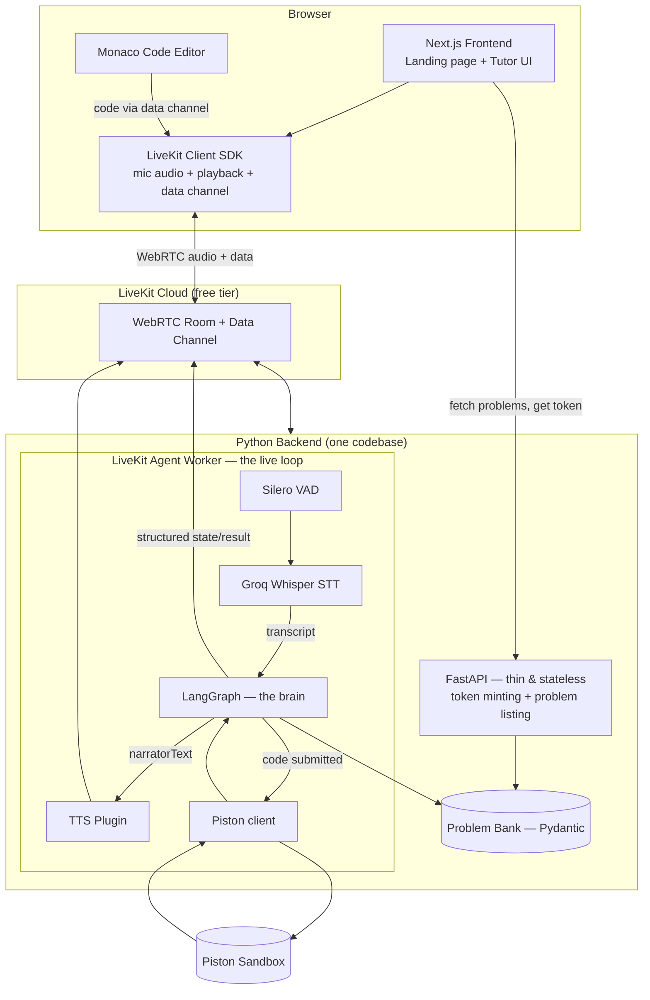
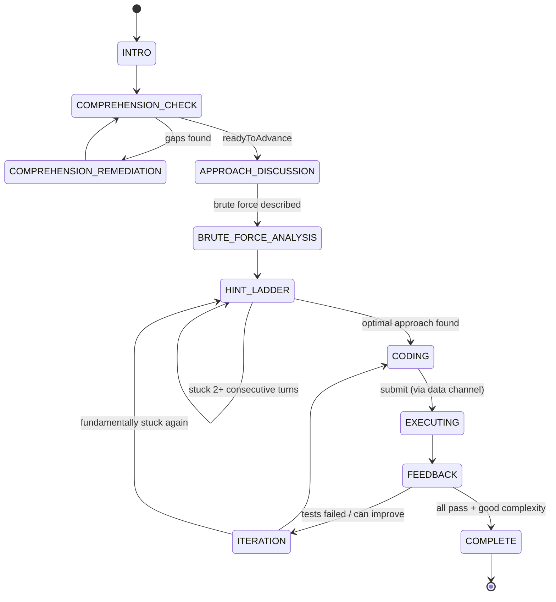

# Voice AI DSA Tutor — MVP Plan

## Context

The goal is a voice-driven AI tutor that walks a user through solving one DSA problem at a time the way a patient human tutor would: explain the problem, probe comprehension (surfacing edge cases/"loopholes" most people miss), grade the user's spoken approach (brute force first, then guide toward optimal via a hint ladder — never skipping ahead), let the user type real code while asking "why" about their decisions, then actually execute that code against test cases and give spoken feedback, looping until the problem is genuinely solved well.

Locked-in decisions:
- **Scope**: web app, single-user, local MVP, no auth/accounts.
- **Code execution**: real sandboxed execution via **Piston** (free, no key).
- **Problems**: small in-house curated problem bank (our own wording, not scraped LeetCode text).
- **Budget**: effectively $0. **Groq** free tier covers the LLM (Llama 3.3 70B) and STT (Whisper large-v3).
- **Voice transport**: **Full LiveKit Agents framework** for real conversational voice — voice-activity detection, natural interruption, streamed turn-taking — instead of a record → upload → playback loop.
- **Orchestration + brain: all in Python.** LiveKit's Agents framework is Python-first, so rather than splitting the brain (TypeScript/LangGraph.js) from the voice I/O (Python), the whole tutoring intelligence lives in **LangGraph (Python)** in the same runtime as the LiveKit agent worker. One language, one process type, no cross-language hop or duplicated schemas between "brain" and "mouth."
- **Landing page**: built against the Mistral AI-derived design system in `DESIGN-mistral.ai.md` (sunset-orange/cream palette, editorial display type + Inter, the signature "sunset stripe" footer band).

## Architecture

Two services: a Next.js frontend (UI shell only — no tutoring logic) and a Python backend that owns everything else. The Python backend has two entry points sharing one codebase: a thin FastAPI app (stateless: mint LiveKit tokens, list problems) and the LiveKit Agent worker (the actual live tutoring loop — voice in, voice out, code in, verdict out). Session state lives only inside the agent worker process for the duration of a room; nothing needs a database or cross-process state sharing.

## Tech Stack

| Layer | Choice | Why |
|---|---|---|
| Frontend | Next.js 14+ (App Router) + TypeScript | UI shell only: landing page, problem selection, Monaco editor, LiveKit client SDK. No tutoring logic here. |
| Backend | Python | Owns 100% of the tutoring intelligence and the real-time voice loop — one language, no schema duplication across a language boundary |
| Orchestration | LangGraph (Python, `langgraph`) | Native, most mature implementation; nodes/conditional-edges match the FSM design; in-memory checkpointer is enough for a single-room MVP session |
| Stateless API | FastAPI | `GET /problems`, `GET /problems/{slug}`, `POST /livekit/token` — nothing session-scoped |
| LLM (grading) | Groq — Llama 3.3 70B, JSON mode, Python SDK | Free tier, fast, cheap-to-free |
| STT | Groq Whisper large-v3 via `livekit-plugins-groq`, inside the agent worker | Better technical-vocabulary accuracy than browser recognition |
| Voice transport + VAD | LiveKit Cloud (free tier) + LiveKit Agents (Python, native) + Silero VAD plugin | Real interruption handling, low-latency streaming, purpose-built for this |
| TTS | TBD LiveKit-supported plugin — see Risks | Groq PlayAI availability as a LiveKit plugin is unverified |
| Code execution | Piston (free public API), called from the agent worker via `httpx` | Real sandboxed execution against test cases |
| Editor | `@monaco-editor/react` (client-only) | Code submitted to the agent worker over the LiveKit data channel — no separate REST execute endpoint needed |
| Styling | Tailwind, tokens from `DESIGN-mistral.ai.md` | See Landing Page section |
| Database | None | Session state lives only in the agent worker process for the room's lifetime |

## Core State Machine (LangGraph, Python)

Each phase is a LangGraph **node**. Grading nodes call Groq in JSON mode, validate with Pydantic, and return structured output; **conditional edges** read that structured output (never free text) to pick the next node — the LLM never chooses its own next phase.

**Anti-rushing guardrail**: `HINT_LADDER` only advances a level once `userSeemsStuck` is true for **2+ consecutive turns** *and* a probing question has already been asked at the current level. A manual "give me a hint" button is a user-controlled override regardless of auto stuck-detection.

**LLM node contracts** (Pydantic-validated, `response_format: json_object`):

| Node | Grounding context injected | Output schema | Content source |
|---|---|---|---|
| Comprehension grader | `comprehension_rubric.key_points`, `constraints`, user's speech | `ComprehensionGrade` | LLM judges coverage only |
| Edge-case remediation | one `common_loopholes` entry | narration only | Loophole text authored verbatim, LLM only rephrases delivery |
| Approach grader (brute force / optimal) | `brute_force`/`optimal_approach` description + complexity | `ApproachGrade` | "Why insufficient" text is authored, not generated |
| Hint delivery | current `hint_ladder[level].text` | `StuckSignal` + narration | Hint text pulled **verbatim**; LLM only decides *when* and phrases delivery |
| Coding-pause probe | actual code diff (from the last data-channel update) | narration question only | Must reference real code, not paraphrase |
| Execution feedback | Piston's actual parsed result | narration only | LLM explains *why*, never invents a pass/fail it wasn't given |

## LLM Brain — Anti-Hallucination Principle

**The LLM is never the source of DSA truth.** Every fact the tutor asserts lives in the authored problem bank or in Piston's real execution output. The LLM's only two jobs per node are to **judge** the user's input against that authored ground truth and to **narrate** the verdict in a warm tutor voice — it's never asked to "know" DSA from training data, which matters because classic problems are exactly what a model has memorized (possibly mismatched) variants of.

Mechanisms:
1. Explicit *"grade solely using the context below, ignore your own memorized knowledge of this problem"* instruction in every grading prompt.
2. Single combined grade+narrate call per node, with a `reasoning` field ordered **before** verdict fields (implicit chain-of-thought inside the JSON object) — keeps latency/rate-limit cost to one call.
3. Authored content (hints, loopholes, brute-force explanations) is always injected as literal text to *deliver*, never *produce from scratch*.
4. Low temperature (~0.2–0.3) for all grading nodes.
5. Pydantic validation is the hard backstop: one repair retry, then a deterministic fallback (`ready_to_advance=False`) — the graph must never crash or hang on bad LLM output.
6. Compact rolling `session_facts` summary (not full transcript) fed into each node — bounds token cost and prevents long-session drift.
7. Log every (prompt, response) pair during build/tuning to actually improve the grading prompts against real phrasing.

*Open trade-off, not pre-decided*: if blending "strict judge" and "warm tutor" hurts grading quality, split into two sequential Groq calls (pure-JSON grader, then a narrator pass) — revisit once real output is observed, not before.

## Problem Bank

`/server/problems/<slug>.py`, each a Pydantic model validated against a shared schema in `/server/problems/schema.py`.

| Field | Purpose |
|---|---|
| `statement`, `constraints` | Our own wording — not copied LeetCode text |
| `starter_code`, `reference_solution` | Single language for MVP (Python or JS) to limit harness-authoring work |
| `test_cases` | Each tagged `is_edge_case` + `edge_case_tag` + `explanation_if_failed` |
| `brute_force{description, complexity, why_insufficient}` | Authored ground truth for the brute-force node |
| `optimal_approach{description, complexity}` | Authored ground truth for the approach node |
| `hint_ladder[{level, text}]` | Ordered vague → specific, delivered verbatim |
| `common_loopholes[{id, description, related_test_case_id}]` | Drives comprehension remediation |
| `comprehension_rubric.key_points` | What the user should mention when explaining the problem back |

Exposed read-only to the frontend via `GET /problems`, `GET /problems/{slug}` on FastAPI; the same Pydantic objects are imported directly into the LangGraph nodes for grounding — one source of truth, no duplication.

## Piston Integration

One Piston call per submission (not per test case — shared free instance, unpublished rate limits). Code arrives at the agent worker over the **LiveKit data channel** (not a REST endpoint) since the worker already holds the room's session state. `/server/execution/harness.py` renders the user's code into a per-language harness template embedding all test cases and printing one JSON result array to stdout; `/server/execution/piston.py` POSTs to Piston via `httpx` and parses `run.stdout`/`stderr`. Compile/runtime failures map to a friendly "your code didn't run: `<reason>`" result. On success, the deterministic pass/fail result (prioritizing the first failing **edge case**) feeds both the LangGraph transition and the feedback node's narration, and a structured result is also published back over the data channel so the UI's `TestResultsPanel` can render it directly (not just spoken).

## Landing Page

Built from `DESIGN-mistral.ai.md` — the sunset-orange/cream editorial system. One flag before building: **PP Editorial Old is a commercial font we don't have a license for.** Recommend substituting a free, similarly-toned editorial serif — **Fraunces** (Google Fonts, warm literary display character) — for hero/display type, keeping Inter and JetBrains Mono exactly as specified.

| Section | Component(s) used | Notes |
|---|---|---|
| Top nav | Standard sticky white bar per doc | Logo + links + `button-dark` "Try it" CTA |
| Hero | `hero-band-sunset` | Headline in Fraunces (substitute for PP Editorial Old), subtitle in Inter, sunset gradient background, `button-primary` + `button-secondary` |
| Feature row (3-up) | `card-feature` | "Understand the problem" / "Find the approach" / "Write & defend your code" — mirrors the tutoring loop |
| Demo mockup | `code-block` + `code-block-header` | Dark IDE-style mockup showing a snippet of the hint-ladder conversation |
| Stat row | `stat-cell` | Illustrative, e.g. "3-stage grading", "Real sandboxed execution" |
| Closing CTA | `cta-banner-cream` | Cream panel, Fraunces headline, `button-dark` CTA |
| Footer | `footer-region` + `footer-link` | Cream-tinted, per doc |
| **Sunset stripe band** | `sunset-stripe-band` | **Mandatory at the very foot of the page per the design doc's brand rule — never omit** |

Buttons stay `{rounded.md}` (8px), cards `{rounded.lg}` (12px), no pill buttons except badges — per the doc's "sober, editorial, not playful" rule.

## Build Sequencing

Voice is still deliberately last, but note the change: M2–M6 now prove the LangGraph brain via a lightweight **local dev harness** (a plain Python script or a `/dev/turn` FastAPI endpoint that feeds text straight into the graph, bypassing LiveKit entirely) — the exact same graph code the agent worker calls in M7, just exercised without any audio infrastructure first.

| # | Milestone | Deliverable | Depends on |
|---|---|---|---|
| M0 | Scaffolding | `/web` (Next.js+TS+Tailwind, design tokens wired in) and `/server` (Python: FastAPI, LangGraph, LiveKit Agents deps) repo layout; `.env` for `GROQ_API_KEY`, LiveKit keys | — |
| M1 | Landing page | Marketing page per the design table above | M0 |
| M2 | Problem bank | 2 problems authored as Pydantic models, FastAPI list/detail endpoints, frontend pages render them — zero AI involved | M0 |
| M3 | LangGraph skeleton | Graph wired with **stubbed** canned grader responses, exercised via the local dev harness — proves the graph shape before any external dependency | M2 |
| M4 | Real Groq grading | Swap stubs for real Groq JSON-mode calls + Pydantic validation + retry/fallback; still via the dev harness | M3 |
| M5 | Piston execution | Harness rendering + `httpx` Piston calls wired into the `EXECUTING` node, tested via the dev harness with hardcoded code strings | M4 |
| M6 | Iteration + hint polish | Stuck-streak gating tuned, "make it better" loop, full manual text-only playthrough via the dev harness | M5 |
| M7 | Voice layer (LiveKit) | LiveKit Cloud project, agent worker (Silero VAD + Groq Whisper STT + TTS plugin) invoking the same graph, LiveKit client SDK + Monaco data-channel wiring in the Next.js frontend | M6 |
| M8 | Hardening | Coding-pause probes, Groq/Piston/LiveKit failure states, 1-2 more problems, styling pass | M7 |

## Risks / Open Questions

- **TTS provider inside LiveKit is unresolved** — Groq's PlayAI TTS may not have a ready LiveKit plugin; since audio must stream server-side into the room, the fallback isn't "browser TTS" anymore, it's "pick another LiveKit-supported provider's free tier" (e.g. Cartesia, ElevenLabs) if Groq isn't available there. Confirm at the start of M7.
- **LiveKit Cloud free-tier limits** — confirm current bundled minutes before relying on it for repeated testing.
- Groq free-tier rate limits; JSON-repair retries double some calls.
- Piston has no documented SLA; design a graceful "execution unavailable, try again" state.
- Never `eval` LLM output; Pydantic + fallback defaults handle malformed grading JSON.
- PP Editorial Old license — using Fraunces as the substitute unless a license is obtained.
- Exactly one language for MVP to limit harness-authoring burden.
- Data-channel message design (code submission, structured state/result sync to the UI) needs a small explicit schema of its own — define alongside the LangGraph node schemas in M7, not improvised ad hoc.

## Verification

| Milestone | How to verify |
|---|---|
| M1 | Load the landing page, confirm it visually matches the design table incl. the sunset stripe footer |
| M2 | Navigate problem list/detail pages, confirm schema-validated content renders |
| M3 | Run the dev harness through the full graph with canned responses — every transition fires with no external calls |
| M4 | Same playthrough with real Groq calls; try "understood well" and "confused" phrasings to confirm grading/remediation paths |
| M5 | Feed correct/incorrect/edge-case-failing code strings through the dev harness; confirm Piston results map to the right narration |
| M6 | Full manual start-to-finish text-only playthrough via the dev harness; confirm no premature hint advancement |
| M7 | Full voice playthrough via LiveKit; confirm interruption works, transcription is accurate on DSA vocabulary, code submission over the data channel triggers execution, TTS latency/quality acceptable |
