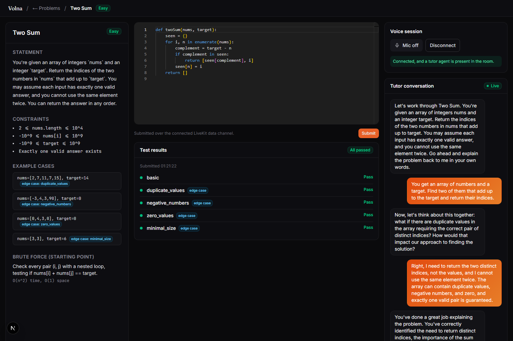

# Volna

**Solve DSA problems out loud, the way you'd work through maths in front of a tuition or classroom teacher!**

You talk to it out loud. It makes you explain the problem back in your own words, defend a brute-force approach before it'll let you near the optimal one, gives hints only once you're actually stuck, and then runs your real code against real test cases in a sandbox instead of an LLM guessing whether it's right.



---

## Why this exists

Most "AI tutor" demos are a chat box wrapped around an LLM that will cheerfully explain the optimal solution the moment you ask twice. Volna is built to feel like the opposite: less a chatbot, more a classroom teacher standing over your shoulder while you work through a problem on the board. It's a **deterministic tutoring flow** (built as an explicit state machine) where the LLM is only ever allowed to do two things — *judge* what you said against facts a human wrote ahead of time, and *narrate* that judgment out loud. It never invents a hint, an edge case, or a pass/fail result. Every fact the teacher states either came from an authored problem file or from actually running your code.

If you want the deep, from-first-principles version of everything below (written for someone with zero agentic/voice AI background), see **[`INTERVIEW-PREP.md`](INTERVIEW-PREP.md)**. The full original architecture write-up is in **[`PLAN.md`](PLAN.md)**.

## What it actually does

1. **Explain it back** — you restate the problem in your own words; it's graded against an authored rubric, not vibes. Miss something and it surfaces the specific edge case you're missing (verbatim, authored text — never invented) and asks you to try again.
2. **Defend the brute force** — you have to describe the naive solution and why it falls short before the hint ladder will engage. No skipping straight to "just use a hashmap."
3. **Climb the hint ladder** — hints escalate one level at a time, and only after you've seemed genuinely stuck for two consecutive turns, not one confused sentence.
4. **Write real code** — a full Monaco editor (the same one VS Code uses) in the browser, with the tutor able to ask about specific decisions in your actual code.
5. **Get graded for real** — your code runs in a sandboxed executor (Piston) against real test cases, including the edge cases people usually forget. Passing isn't enough, either: a correct-but-slow solution gets caught by an empirical time/memory-complexity check before it's marked complete.

## Problems currently in the bank

| Problem | Difficulty |
|---|---|
| Two Sum | Easy |
| Add Two Numbers | Medium |
| Longest Substring Without Repeating Characters | Medium |
| Median of Two Sorted Arrays | Hard |
| Longest Palindromic Substring | Medium |

Each is authored as JSON (`server/problems/data/authored/`) — statement, constraints, test cases, brute-force/optimal descriptions, a hint ladder, common edge cases, and (where it's empirically reliable) a complexity probe.

## Architecture, briefly

```
Browser  ──fetch──▶  FastAPI (stateless: list problems, mint LiveKit tokens)
   │
   └──WebRTC (voice + a data channel for code)──▶  LiveKit Agent worker
                                                          │
                                          Silero VAD → Groq Whisper STT
                                                          │
                                                    LangGraph brain
                                                     (the state machine)
                                                          │
                                              Deepgram TTS ◀── narration
                                                          │
                                                   Piston sandbox
                                                (real code execution)
```

- **Frontend** (`web/`) is a plain UI shell — it holds zero tutoring logic. Next.js (App Router) + TypeScript + Tailwind, Framer Motion for animation, the real Monaco editor, LiveKit's client SDK for the voice connection.
- **Backend** (`server/`) is one Python codebase, two entry points: a small stateless FastAPI app, and a LiveKit Agents worker that owns the actual live tutoring loop.
- **The brain** (`server/graph/`) is a LangGraph state machine — each tutoring phase (comprehension check, approach discussion, hint ladder, execution feedback, ...) is a node; the LLM never decides its own next step, only produces structured, schema-validated judgments that plain Python routes on.
- **No database.** Session state lives in memory for the life of one conversation; a small JSON checkpoint file is written only when a session is idle-disconnected, so reconnecting resumes instead of restarting.

## Tech stack

| Layer | Choice | Notes |
|---|---|---|
| Frontend | Next.js 16 (App Router), TypeScript, Tailwind CSS v4, Framer Motion | UI only, no tutoring logic |
| Code editor | `@monaco-editor/react` | Same editor as VS Code, loaded client-side only |
| Voice transport | LiveKit Cloud + `livekit-agents` (Python) | Real-time WebRTC room, VAD, turn detection, interruption handling |
| STT | Groq-hosted Whisper large-v3 | Chosen for technical-vocabulary accuracy and a free tier |
| TTS | Deepgram | Groq has no LiveKit-compatible TTS plugin |
| LLM | Groq — Llama 3.3 70B, strict JSON-mode output | Used only to judge and narrate, never to author facts |
| Orchestration | LangGraph | Explicit state machine: nodes + code-driven conditional edges |
| Stateless API | FastAPI | Problem listing + LiveKit token minting only |
| Code execution | Piston, self-hosted via Docker | Real sandboxed execution, not a guess |
| Validation | Pydantic | Every LLM response is schema-validated before anything trusts it |
| Problem data | Flat JSON files | Editable without touching code; no database |

## Getting started

**Prerequisites**
- Python 3.11+ with a venv at `server/.venv` (`pip install -r server/requirements.txt`)
- Node.js, with `npm install` run inside `web/`
- Docker Desktop running (for the self-hosted Piston sandbox)
- A `.env` file at the repo root with `GROQ_API_KEY`, `DEEPGRAM_API_KEY`, `LIVEKIT_URL`, `LIVEKIT_API_KEY`, `LIVEKIT_API_SECRET`

**Four things run at once, each in its own terminal:**

```bash
# 1. Piston (only needs to be started once; keeps running across sessions)
docker run -d --name piston_api --privileged -p 2000:2000 ^
  -v "<repo-path>\.piston-data\packages:/piston/packages" ^
  --tmpfs /piston/jobs:exec ^
  -e PISTON_OUTPUT_MAX_SIZE=131072 -e PISTON_MAX_FILE_SIZE=10000000 ^
  ghcr.io/engineer-man/piston

# 2. FastAPI backend
cd server && .venv\Scripts\python.exe -m uvicorn api.main:app --reload --port 8000

# 3. LiveKit voice agent worker -- must be run as a module, not a script
cd server && .venv\Scripts\python.exe -m agent.worker dev
# wait for a "registered worker" log line before connecting from the frontend

# 4. Frontend
cd web && npm run dev
```

Then open `http://localhost:3000/tutor/two-sum` (or any slug from `http://localhost:3000/problems`), click **Connect voice**, allow microphone access, and wait for the "tutor agent present" indicator before speaking.

## Project structure

```
web/                     Next.js frontend (UI shell only)
  app/                   Routes: landing page, /problems, /tutor/[slug]
  components/            Editor, chat transcript, voice controls, landing page sections
server/
  api/                   Stateless FastAPI app (problem listing, token minting)
  agent/worker.py        LiveKit Agent worker -- the live voice + tutoring loop
  graph/                 The brain: LangGraph state machine
    nodes/               One file per tutoring phase
    prompts/             System/user prompt builders per node
    schemas.py           Pydantic schemas every LLM call is validated against
    persistence.py        Idle-session checkpoint save/load
  problems/              Problem bank (schema + JSON content + loaders)
  execution/             Piston client + code-execution harness rendering
  dev/                   Real-API regression scripts (run directly, not pytest)
```

## Deployment

The frontend deploys to Vercel on its own (Root Directory set to `web/`) — see the Vercel project settings for the Ignored Build Step used to skip rebuilds on backend-only commits. The backend is intentionally kept local-only for now: every real conversation costs real LLM/STT/TTS API calls, so it only runs while actively demoing.

## Known rough edges

- The LiveKit room name the frontend requests must exactly match a real problem slug (e.g. `two-sum`) — that's how the worker figures out which problem to tutor.
- One problem (Longest Palindromic Substring) deliberately ships without a complexity check — real testing showed no input-size range reliably distinguishes the relevant approaches for it, so an unreliable check was left out rather than shipped anyway.
- Groq's free-tier daily token quota (100k/day at time of writing) is easy to exhaust during heavy testing; every LLM call has a safe, honest fallback for when that happens rather than crashing the session.

## Further reading

- [`PLAN.md`](PLAN.md) — the original architecture and design-rationale document
- [`INTERVIEW-PREP.md`](INTERVIEW-PREP.md) — a from-zero explainer of the entire project, every concept defined, written for someone new to agentic/voice AI
- [`DESIGN-mistral.ai.md`](DESIGN-mistral.ai.md) — the design system the landing page is built against
